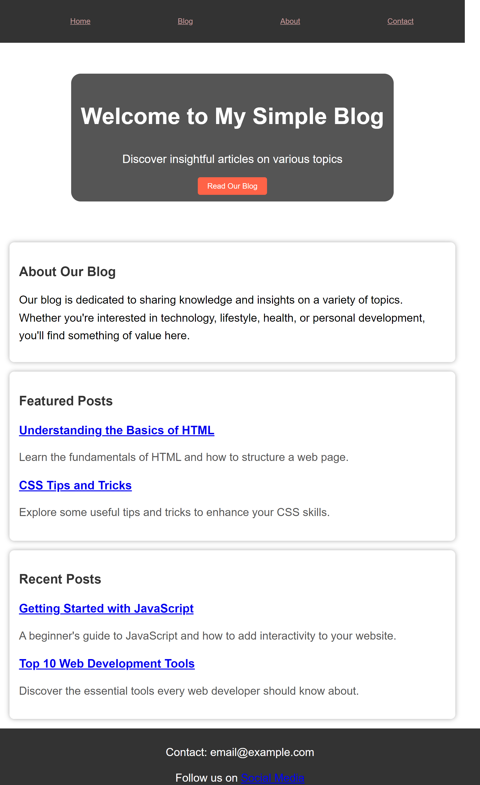
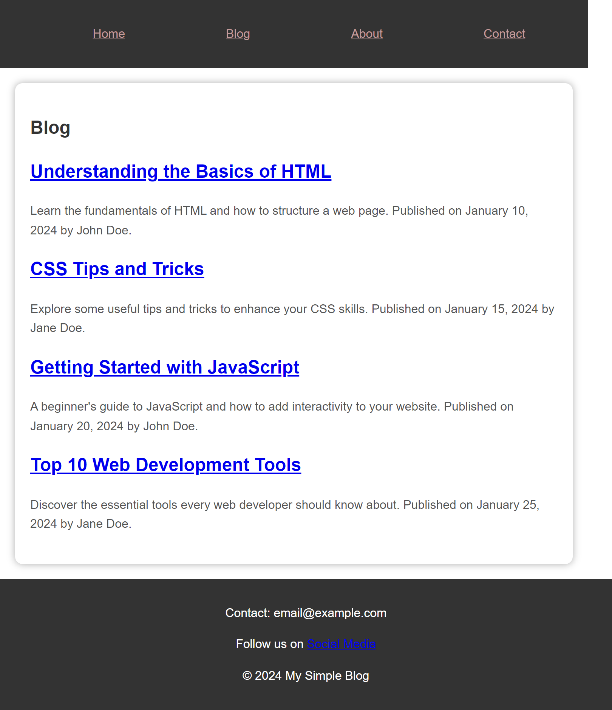
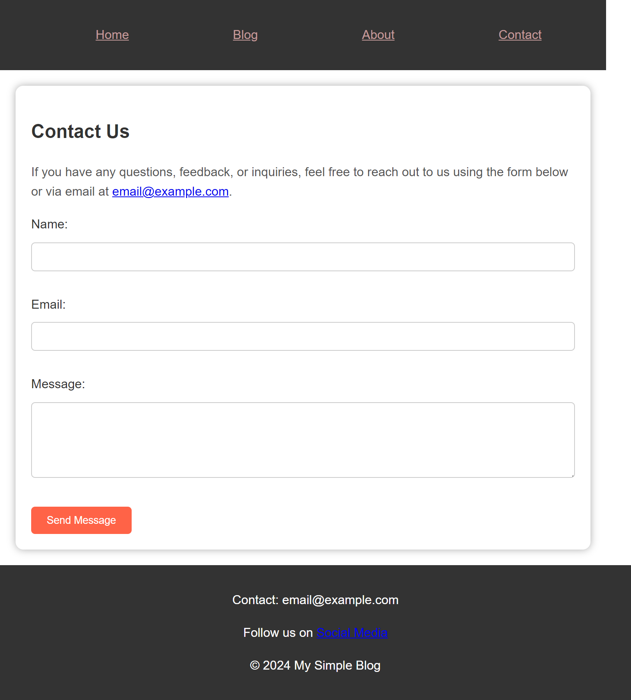

# internet_applications_programming_assignments
An Assignment related to web programming I am taking at uni.

[Website link. This is a link to a live version of the simple site.](https://mwangigregory.github.io/internet_applications_programming_assignments/)

## Home page => [index.html](index.html)

## Blog page => [blog.html](blog.html)

## About page => [about.html](about.html)

## Contact page => [contact.html](contact.html)

